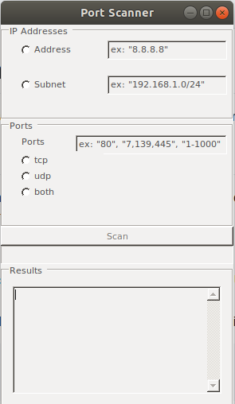

# ITC567-Assignment3-PortScanner
A Windows Form application that can scan given ports for a given IPv4 address or IPv4 subnet.

## How to compile and run

The application has been tested in Ubuntu 18.04. Some asynchronous bugs may occur.
The application has a bug with not displaying results when run in Windows.
Mono is required to compile the code.

Ubuntu 18.xx and higher:
1. Install .NET 5.0 at https://dotnet.microsoft.com/download.
(For installation on Ubuntu 18.04, see https://docs.microsoft.com/en-us/dotnet/core/install/linux-ubuntu#1804-)
2. Install Mono (Mono makes it possible to compile and run Windows Form applications on Linux):
```
sudo apt-get install mono-complete
sudo apt-get update
```
3. Compile the program with Mono's C# compiler and run the executable with Mono:
```
mono-csc program.cs -r:System.Windows.Forms.dll -r:System.Drawing.dll
mono program.exe
```

Windows:
Compile in a Ubuntu machine first, then copy the program.exe file to Windows.


